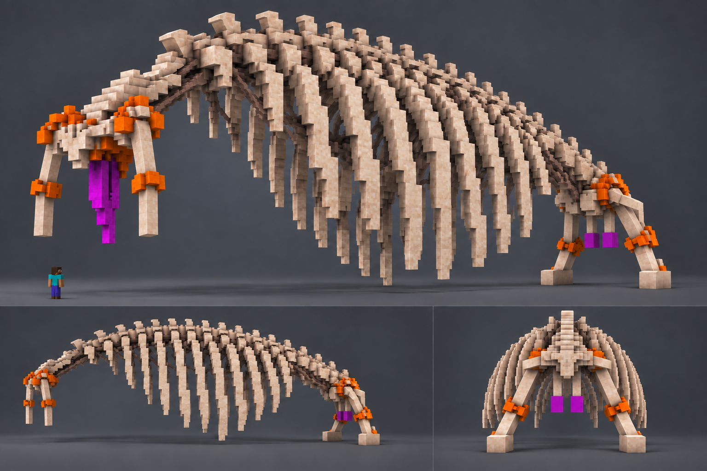

# Founding Penis — визуальный концепт

Основа — изображения из `/home/kirill/refer_mods/found`: длинный выгнутый позвоночник, широкий открытый каркас рёбер, костяной цвет, оранжевые сочленения и фиолетовый отросток спереди. Передние руки состоят из плеча, оранжевого локтя и предплечья; они короче, чем на первом рисунке, но оканчиваются простыми костяными срезами без ладоней и пальцев. Задние ноги также без лап и когтей. Хвоста нет. Из нижней части таза **вниз свисают два атакующих члена**: отдельные светлые стержни с пурпурными концами, как у одноимённого предмета мода. На рисунке также есть вид сбоку, вид сзади и игрок для сравнения масштаба.

Чтобы Founding Penis выглядел существом, а не постройкой, позвонки и рёбра различаются по форме и длине, а кости соединены тёмными тканями. Высота игровой модели составляет около **30 блоков**; пропорции на рисунке служат ориентиром, а не точной сеткой Blockbench.

Игровая механика: предмет из атакующего члена и женской вагины превращает игрока в Founding Penis на 60 секунд. Превращение вызывает взрыв; ЛКМ выпускает большой белый снаряд, а ПКМ вызывает взрыв с перезарядкой 60 секунд.
